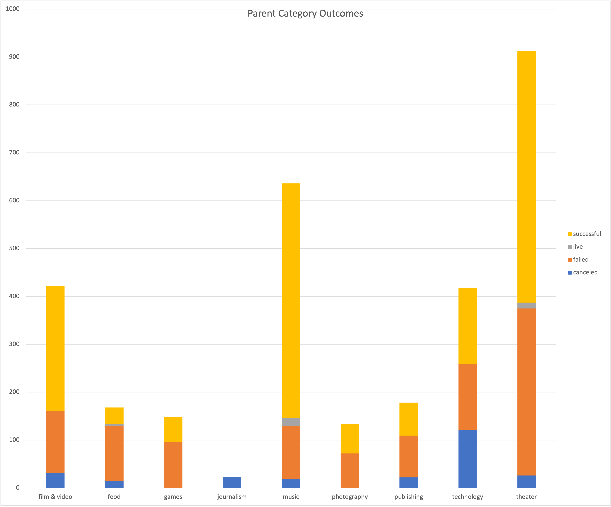
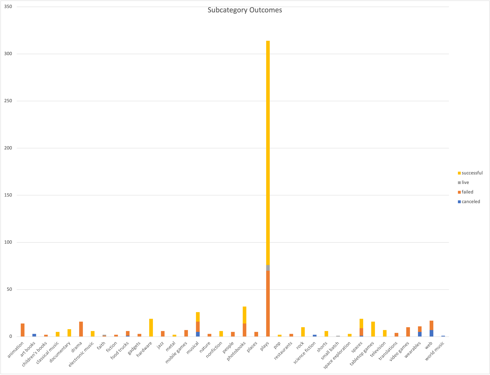

# An Analysis of Kickstarter Campaigns
This analysis of Kickstarter campaigns, conducted for Louise, focuses on Kickstarter campaigns for plays run in Great Britan. 
---
**We began our analysis by examining the best times of year to launch a Kickstarter campaign. The results, which found the best month to launch a campaign is May, can be seen here:

---
Next,we filtered our data to locate five plays from Edinburg Festival Fringe that Louise was inspired by. Each of the five plays were successful. The campaign's description, its goal, pledged amount, average donation and number of backers can be found in the "Edinburg Research" sheet, here [Kickstarter Data](https://github.com/samlilburn07/kickstarter-analysis/blob/6eb0de3fab62e383c2c8bb9353b9932785a4f3bf/data-1-1-3-StarterBook.xlsx).
---
Louise is considering a Kickstarter campaign for a play in Great Britain. So, we gathered the data of campaigns for plays in Great Britan and created and visualization of their success rate, seen here .
---
To further assist Louise in her decision, we looked at measures of central tendency for all Kickstarter campaigns run for plays in the US in our data, seen here [Kickstarter Data](https://github.com/samlilburn07/kickstarter-analysis/blob/6eb0de3fab62e383c2c8bb9353b9932785a4f3bf/data-1-1-3-StarterBook.xlsx), in the "Descriptive Statistics" sheet. In these statistics, we found that failed Kickstarter campaigns have much higher fundraising goals than successful ones. Additionally, the mean and median pledged amounts in failed Kickstarter campaigns for plays are much lower than those of successful campaigns, which suggests campaigns fail for reasons beyond unreasonable funding goals. 
---
After examining measures of central tendancy, we looked at measures of spread in the same data. These measures can be seen here [Kickstarter Data](https://github.com/samlilburn07/kickstarter-analysis/blob/6eb0de3fab62e383c2c8bb9353b9932785a4f3bf/data-1-1-3-StarterBook.xlsx), also in the "Descriptive Statistics" sheet. In the measures of spread, we found that the third quartile of each distribution is around the mean. That data follows similar distributions in each subset. This showed that large numbers are skewing the mean upwards in each data set. The standard deviations of these data sets are larger than the means, so everything below the mean is considered to be close to the center. The standard deviations are all about twice the size of the IQR in each distribution, except for the failed campaigns, where the standard deviation is closer to three times the IQR. This shows us that the failed Kickstarter campaigns had higher goals. In this case, too high. 
---
**To give Louise a common sense visualization of our measures of tendancy and spread, we created box and whisker plots. The plots can be seen here . From these plots, we can see that the mean campaign goal is around 4,000 pounds. This is outside the range of outliers for amount pledged, so Louise should probably try to get her play produced for less than 4,000 pounds. Half of the campaign goals are less than 2,000 pounds, which is just over the 3rd quartile for amounts pledged.
---
In light of these findings and their demonstration of the success of Kickstarter campaigns runs for plays in Great Britain, further seen here  and here , we have recommendations for Louise. We reccomend that she runs her campaign in May, as this is the month when the most successful campaigns of this nature are run. We also suggest that she sets a realistic funraising goal. Specifically, a goal less than 4,000 pounds. "Foresight" was previously successful in Great Britain and we believe it could be again if Louise chooses it as her plays. With all this in mind, we wish Louise the best, and hope for a successful Kickstarter campaign for a play in May.
